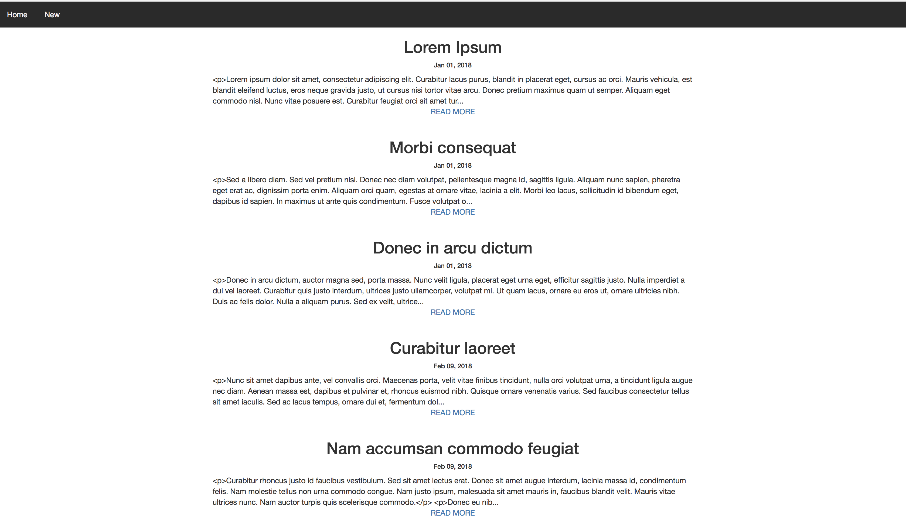
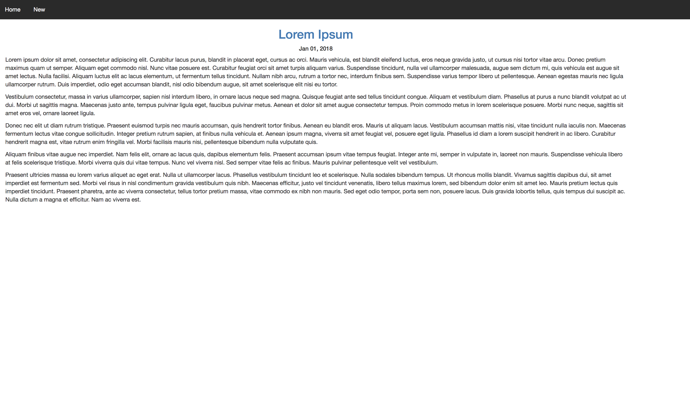
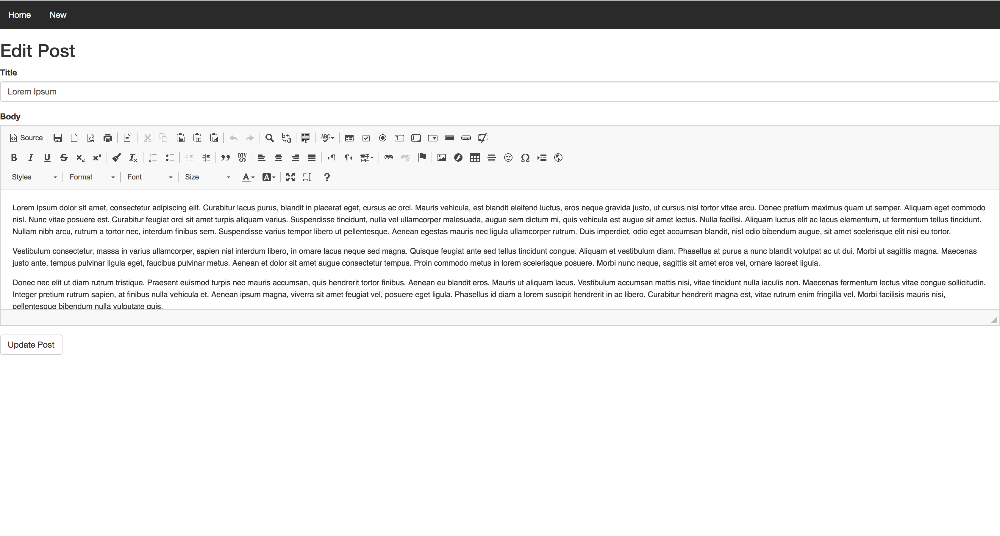
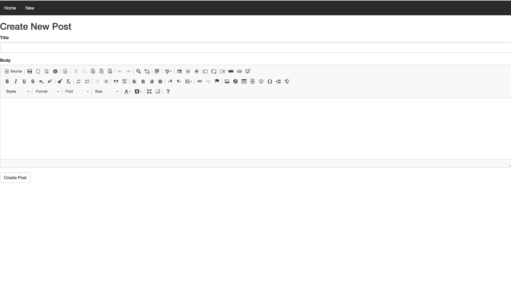

# Rails Blog Manager

A simple blog manager. Useful for beginners learning about the 7 restful actions of rails, routes, and how controllers interact with models and views.

| Main                        | Post                        |
| --------------------------- | --------------------------- |
|||

| Edit                        | New                        |
| --------------------------- | --------------------------- |
|||

## Getting Started

### Prerequisites

* A Ruby Version Manager
* A package manager, like [bundler](http://bundler.io/)

### Installing

* Clone this repo.

```
git clone https://github.com/jacobsteves/Rails-Blog-Manager.git
```

* Initialize our local repo: 
```
bundle install && rake db:migrate
```

* Start the rails server: 
```
rails s
```

## Versioning

We use [SemVer](http://semver.org/) for versioning. For the versions available, see the [tags on this repository](https://github.com/jacobsteves/BananaMan/tags).

## License

This project is licensed under the MIT License - see the [LICENSE](LICENSE) file for details
